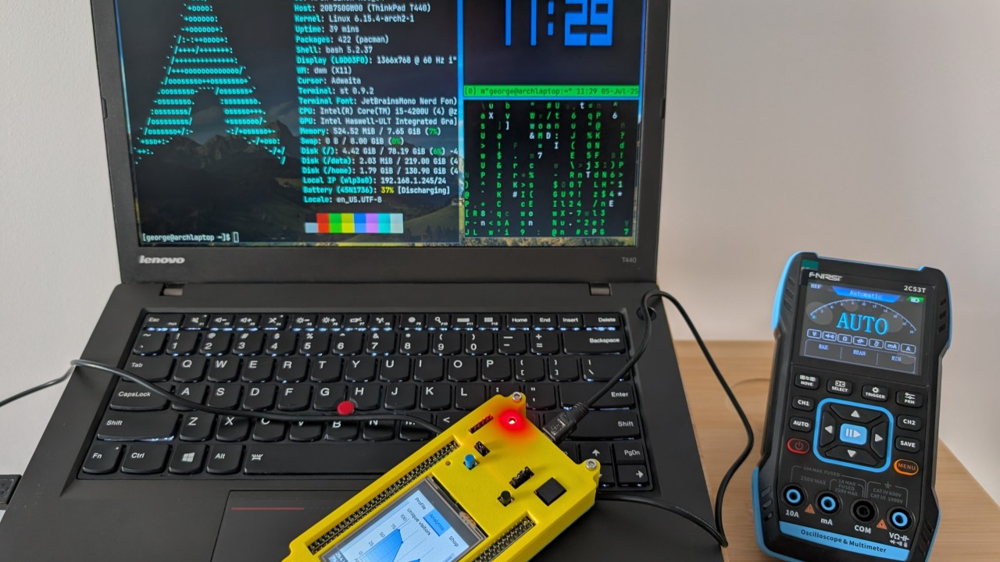
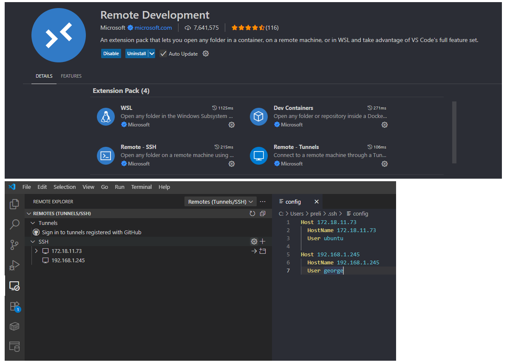

# Rust for Embedded Systems: A Hands-On Journey with the STM32F429I-DISC1 - Part 1

Welcome! In this chapter, you'll set up everything you need to start developing bare-metal Rust applications for ARM Cortex-M4 microcontrollers, like the STM32F429I-DISC1 board. This guide covers both Arch Linux and Windows Subsystem for Linux (WSL2).

> **Who is this for?**  
> This guide is aimed at new graduates, students, and hobbyists with basic command-line experience. No prior embedded or Rust experience is required.

> **Note for Learners Without Hardware:**  
> If you don't have access to a real STM32F429I-DISC1 board, you can still experiment with embedded Rust using [QEMU](https://www.qemu.org/), an open-source emulator that can simulate ARM Cortex-M microcontrollers. While these articles focus on real hardware, QEMU is a great way to learn and test embedded concepts without a physical board. For QEMU-based embedded Rust tutorials, see the [Embedded Rust Book's QEMU section](https://docs.rust-embedded.org/book/start/qemu.html).

-----

## 1.1 Introduction to Embedded Systems

Embedded systems power many everyday devices — they’re like “hidden computers” built into electronics. They’re specialized to perform dedicated functions, often with real-time operation, and usually have limited hardware and software resources.

**Examples of embedded systems:**
- Cars – engine control units, ABS, infotainment systems
- Home appliances – washing machines, microwaves, smart thermostats
- Consumer electronics – smartphones, digital cameras, smartwatches
- Medical devices – pacemakers, insulin pumps, diagnostic machines
- Industrial machines – robotics controllers, PLCs, CNC machines
- Networking equipment – routers, modems, printers

> **Glossary**
> - **Bare-metal:** Programming a microcontroller or processor directly without an operating system, giving you complete, low-level control over the hardware.
> - **Cross-compiling:** Building code on one platform (e.g., your PC) to run on another (e.g., a microcontroller).
> - **FPU:** Floating Point Unit, a hardware feature for fast math operations.
> - **ST-LINK:** A hardware debugger/programmer built into many STM32 boards.
> - **udev rules:** Linux configuration files that manage device permissions.

-----

## 1.2 Why Rust?

Traditionally, C/C++ have dominated the embedded systems world. But Rust is rapidly gaining ground due to its:

- **Memory safety:** Rust’s compiler catches issues like buffer overflows and data races before your code even runs.
- **Performance:** Delivers speeds on par with C/C++, but with safer, more ergonomic code.
- **Modern ecosystem:** A powerful package manager (cargo), an expanding library set, and excellent tooling make development smoother.

> **Further Reading:**  
> [Why Rust for Embedded? (Rust Embedded Book)](https://docs.rust-embedded.org/book/index.html)

-----

## 1.3 Prerequisites

Before you begin, make sure you have:

- Basic familiarity with the terminal/command line.
- An STM32F429I-DISC1 board and a micro-USB cable. *(Optional: You can use a different board, or use QEMU to test the binaries if you don't have hardware.)*
- Administrative (sudo) access on your computer.

> **Tip:**  
> If you’re using a different STM32 board, check its chip type (e.g., Cortex-M0, M3, M4, M7) and adjust the target triple in later steps.

-----

## 1.4 Install rustup

**rustup** is the official tool for installing and managing Rust versions and components. It will help you get Rust ready for embedded development. For more details, visit the official Rust website: [https://www.rust-lang.org/learn/get-started](https://www.rust-lang.org/learn/get-started)

-----

### 1.4.1 Arch Linux

Install `rustup` using `pacman`:

```bash
sudo pacman -S rustup
```

Then, initialize `rustup` by installing the stable Rust toolchain:

```bash
rustup install stable
```

-----

### 1.4.2 Windows Subsystem for Linux (WSL2)

Run this command in your WSL2 terminal (e.g., Ubuntu, Debian):

```bash
curl --proto '=https' --tlsv1.2 -sSf https://sh.rustup.rs | sh
```

Follow the prompts and choose the default installation option (option 1). This will set up the stable Rust version.

> **Note:**  
> WSL2 does **not** support USB device passthrough natively. If you want to flash/debug hardware from WSL2, you’ll need to use [usbipd-win](https://github.com/dorssel/usbipd-win) or run flashing/debugging tools on Windows natively. For most users, running these tools on Linux or a native Linux machine is simpler.

-----

### 1.4.3 Verify Installation

After installation, restart your terminal or run `source ~/.bashrc` (or `source ~/.zshrc`) to update your environment. Then, check if `rustc` (the Rust compiler) and `cargo` (Rust's package manager) are working:

```bash
rustc --version
cargo --version
```

**Example output:**
```
rustc 1.89.0 (29483883e 2025-08-04)
cargo 1.89.0 (c24e10642 2025-06-23)
```

-----

## 1.5 Add Embedded Targets for Cross-Compiling

To program microcontrollers, you need to "cross-compile" your Rust code. This means compiling code on your computer (e.g., x86) to run on a different type of processor (like the ARM Cortex-M4 on your STM32 board).

List available targets:

```bash
rustup target list
```

For the STM32F429I-DISC1 board (ARM Cortex-M4 with FPU), add the `thumbv7em-none-eabihf` target:

```bash
rustup target add thumbv7em-none-eabihf
```

**Other common targets:**

- **Cortex-M0+ chips:**
  ```bash
  rustup target add thumbv6m-none-eabi
  ```
- **Cortex-M3 chips:**
  ```bash
  rustup target add thumbv7m-none-eabi
  ```
- **Cortex-M4/M7 chips (without FPU):**
  ```bash
  rustup target add thumbv7em-none-eabi
  ```

> **Note:**  
> `v7m` / `v7em` refer to ARM architecture versions:
> - **`v7m`**: ARMv7-M (e.g., Cortex-M3)
> - **`v7em`**: ARMv7E-M (Enhanced, e.g., Cortex-M4/M7, adds DSP extensions)

-----

## 1.6 (Optional) Install cargo-generate

**cargo-generate** helps you quickly set up new Rust projects using templates. For this guide, we'll build from scratch, so this step is optional.

```bash
cargo install cargo-generate
```

> **Optional:**  
> If you want to use project templates from the community, check out [embedded Rust templates](https://github.com/rust-embedded/cortex-m-quickstart).

-----

## 1.7 Install Debugging Tools: probe-rs and arm-none-eabi-gdb

These tools let you flash code to your board and debug it.

-----

### 1.7.1 Install probe-rs (and cargo-embed)

**probe-rs** is a modern debugging tool for many debug probes, including the one built into your STM32 Discovery Kit. **cargo-embed** makes it easy to build, flash, and view debug messages.

Install probe-rs tools:

```bash
curl --proto '=https' --tlsv1.2 -LsSf https://github.com/probe-rs/probe-rs/releases/latest/download/probe-rs-tools-installer.sh | sh
```

> **Official installation guide:**  
> See the [probe-rs Getting Started & Installation documentation](https://probe.rs/docs/getting-started/installation/) for more details and alternative installation methods.

Verify installation:

```bash
probe-rs --version
cargo-embed --version
cargo-flash --version
```

**Example output:**
```
probe-rs 0.29.1 (git commit: 1cf182e)
cargo embed 0.29.1 (git commit: 1cf182e)
cargo flash 0.29.1 (git commit: 1cf182e)
```

-----

### 1.7.2 Install arm-none-eabi-gdb

**arm-none-eabi-gdb** is a version of the GNU Debugger for ARM microcontrollers.

On Arch Linux:

```bash
sudo pacman -S arm-none-eabi-gdb
```

On WSL2 (Ubuntu/Debian):

```bash
sudo apt update
sudo apt install gcc-arm-none-eabi
```

Verify installation:

```bash
arm-none-eabi-gdb --version
```

**Example output:**
```
GNU gdb (GDB) 16.2
```

> **Windows Native Users:**  
> You can also install [GNU Arm Embedded Toolchain for Windows](https://developer.arm.com/downloads/-/gnu-rm) and use it in PowerShell or Command Prompt.

-----

## 1.8 Board Connectivity (Arch Linux / WSL2)

To allow your computer to talk to the STM32F429I-DISC1's built-in debugger (ST-LINK/V2-1) without special permissions, set up udev rules.

First, install helpful tools for identifying USB devices and working with ST-LINK:

On Arch Linux:

```bash
sudo pacman -S openocd stlink usbutils
```

On WSL2 (Ubuntu/Debian):

```bash
sudo apt update
sudo apt install openocd stlink-tools usbutils
```

> **WSL2 USB Limitation:**  
> WSL2 does not support direct USB device access. For flashing/debugging, use a native Linux machine or run tools on Windows.

Identify your ST-LINK device's Vendor ID (`idVendor`) and Product ID (`idProduct`). Connect your STM32F429I-DISC1 board via USB (use the port labeled "USB ST-LINK").

Run:

```bash
lsusb
```

Look for a line like:

```
Bus 002 Device 004: ID 0483:374b STMicroelectronics ST-LINK/V2.1
```

Here, `0483` is the `idVendor` and `374b` is the `idProduct`.

Create a new udev rule file:

```bash
sudo vim /etc/udev/rules.d/99-stlink.rules
```

Add (replace IDs if yours are different):

```udev
# STMicroelectronics ST-LINK/V2-1
ATTRS{idVendor}=="0483", ATTRS{idProduct}=="374b", MODE="0666"
```

Save and close the file. Reload udev rules:

```bash
sudo udevadm control --reload-rules
sudo udevadm trigger
```

Verify that `probe-rs` sees your board:

```bash
probe-rs list
```

**Example output:**
```
The following debug probes were found:
[0]: STLink V2-1 -- 0483:374b:066CFF495177514867242523 (ST-LINK)
```

-----

## 1.9 Troubleshooting

- **Board not detected?**
  - Double-check your USB cable and connection (use a data cable, not just a charging cable).
  - Make sure you reloaded udev rules and used the correct Vendor/Product IDs.
  - Try reconnecting the board and running `probe-rs list` again.
  - On WSL2, remember USB passthrough is not supported by default.
- **Permission denied?**
  - Ensure your user is in the correct groups (e.g., `plugdev` on some distros).
  - Check your udev rule syntax and file permissions.
- **Still stuck?**
  - Search or ask for help in the Rust Embedded Working Group Discord, STM32 forums, or Stack Overflow.

-----

## 1.10 Further Reading & References

- [The Embedded Rust Book](https://docs.rust-embedded.org/book)
- [rust-embedded GitHub](https://github.com/rust-embedded)
- [probe-rs Getting Started](https://probe.rs/docs/getting-started)
- [STM32F429I-DISC1 User Manual](https://www.st.com/resource/en/user_manual/dm00093903-discovery-kit-with-stm32f429zi-mcu-stmicroelectronics.pdf)
- [VS Code Remote Development](https://code.visualstudio.com/docs/remote/ssh)

-----

## 1.11 Remote Development with SSH and VS Code Server

If you want to develop remotely from another PC, you can set up SSH access and use Visual Studio Code's Remote Development features.

### 1.11.1 Setting Up SSH on Your Development Board (Arch Linux)

Install and enable the OpenSSH server:

```bash
sudo pacman -S openssh
sudo systemctl enable sshd.service
sudo systemctl start sshd.service
systemctl status sshd.service
ip addr show
```

The `ip addr show` command will display your board's IP address, which you'll need to connect remotely.

#### Optional: SSH Security Hardening

For enhanced security, consider editing the SSH configuration file at `/etc/ssh/sshd_config`. Always back up the original file first:

```bash
sudo cp /etc/ssh/sshd_config /etc/ssh/sshd_config.bak
sudo vim /etc/ssh/sshd_config
```

- **Change the Default Port:**  
  Uncomment and change the `Port` line (e.g., to 2222):
  ```
  #Port 22
  Port 2222
  ```
  Update your firewall rules to allow the new port.

- **Disable Root Login:**  
  ```
  PermitRootLogin no
  ```

- **Use SSH Keys Instead of Passwords:**  
  Generate SSH keys on your client and copy the public key to the server. To disable password authentication:
  ```
  PasswordAuthentication no
  ```

Restart the SSH service after making changes:

```bash
sudo systemctl restart sshd.service
```

-----

### 1.11.2 Connecting from Windows

You can connect to your Linux machine from Windows using the built-in OpenSSH client or a tool like PuTTY.  
Example using the built-in client (in Command Prompt or PowerShell):

```powershell
ssh username@IP_ADDRESS
```

Replace `username` and `IP_ADDRESS` with your actual user and board IP.

-----

### 1.11.3 Using VS Code Remote Development

1. **Install the "Remote - SSH" extension** in VS Code on your Windows PC.
2. Click the "><" icon in the bottom-left corner and select **"Connect to Host..."**.
3. Enter your board's IP address (and custom port if changed, e.g., `user@192.168.1.100 -p 2222`).
4. VS Code will prompt for credentials and set up the VS Code Server on the remote machine.
5. You can now open folders, edit files, and run terminals on your remote board directly from VS Code.

> **Tip:**  
> For an even smoother experience, install the full [Remote Development extension pack](https://marketplace.visualstudio.com/items?itemName=ms-vscode-remote.vscode-remote-extensionpack).  
> You can then use the **Remote Explorer** tab in VS Code to manage SSH connections and tunnels visually, as shown below:



For more details, refer to the [VS Code Remote Development documentation](https://code.visualstudio.com/docs/remote/ssh).

-----

## 1.12 Next Steps

> **Stay tuned:**  
> Next, we’ll walk through creating a new Rust project, writing your first embedded code, and flashing it to the board!

> **You’re ready!**  
> If you followed all steps and see your ST-LINK in `probe-rs list`, you’re set up for embedded Rust development.  

-----

## 1.13 Quick Reference Table

| Term/Tool         | What it is / Why it matters                          |
|-------------------|-----------------------------------------------------|
| rustup            | Rust toolchain installer/manager                     |
| cargo             | Rust’s package manager and build tool                |
| probe-rs          | Modern debugger/flasher for embedded Rust            |
| arm-none-eabi-gdb | Debugger for ARM Cortex-M microcontrollers           |
| udev rules        | Linux device permission configuration                |
| ST-LINK           | Debugger/programmer built into many STM32 boards     |
| Cross-compiling   | Building code for a different CPU/architecture       |
