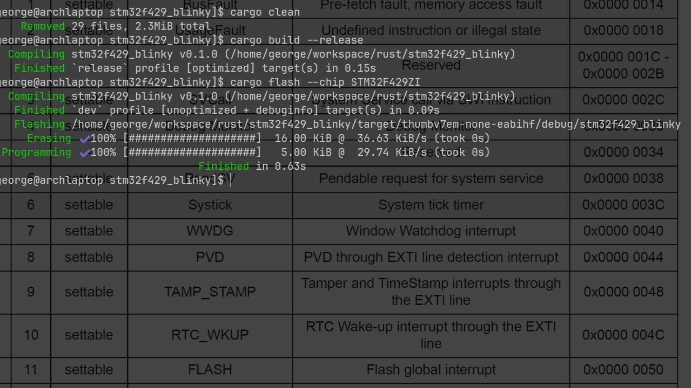
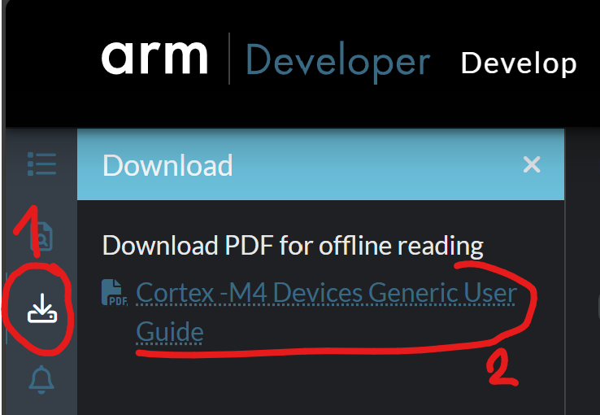
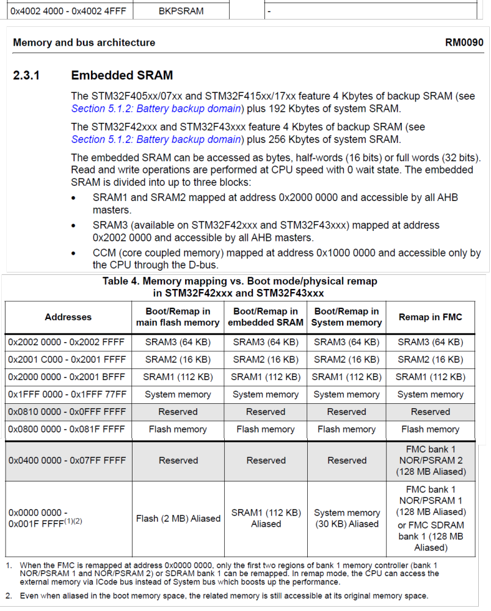
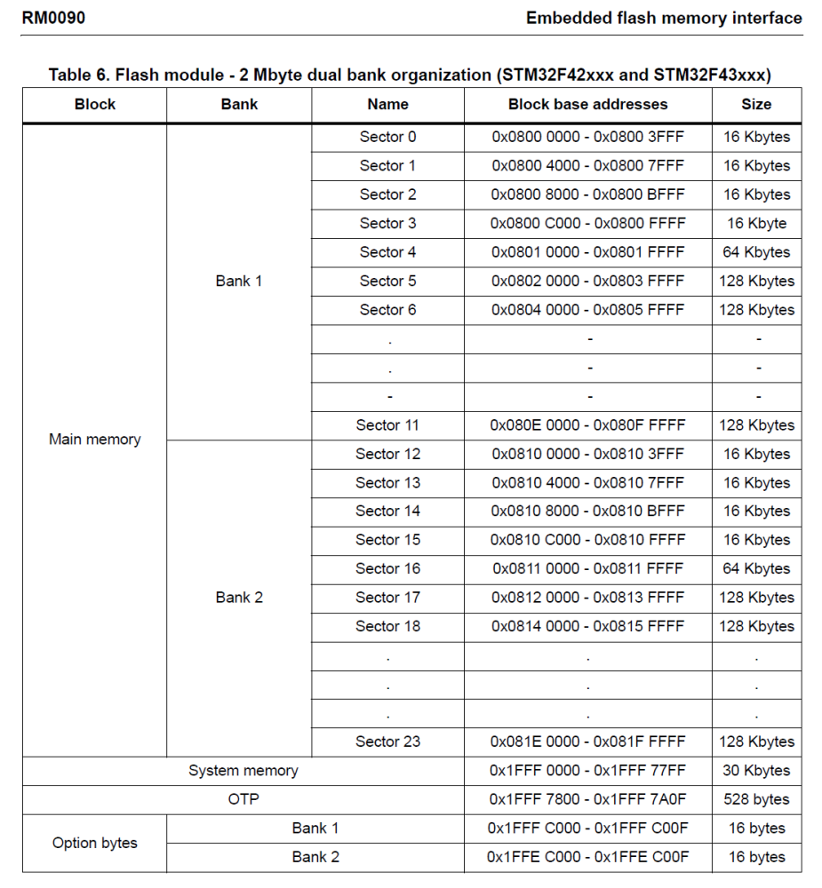

# Rust for Embedded Systems: A Hands-On Journey with the STM32F429I-DISC1

## Part 2: First Bare-Metal Project

> **Missed Part 1?**  
> [Click here for Part 1: Prerequisites and Environment Setup](./part_01.md)

---

### 2.1 Gathering Essential Documentation

Before we start writing any bare-metal code for a microcontroller, the absolute first step is to gather and understand the relevant documentation. This is paramount, as bare-metal programming involves direct interaction with hardware, and every register, bit, and clock setting must be configured precisely according to the manufacturer's specifications. Relying on guesswork or outdated examples can lead to frustrating debugging sessions or even hardware damage.

For the STM32F429I-DISC1, you will need the following documents:

### Microcontroller Reference Manual (RM)

This is arguably the most important document for bare-metal development. This comprehensive document details every peripheral, register, bit field, and memory map of the microcontroller. It explains:

  * **Memory Map**: Where peripherals, flash memory, RAM, and other components are located in the microcontroller's address space.
  * **Clock System (RCC)**: How to configure the various clocks that power the CPU and peripherals. This is crucial for ensuring your peripherals operate at the correct speeds.
  * **General-Purpose Input/Output (GPIO)**: How to configure pins for input, output, alternate functions, speed, and pull-up/pull-down resistors.
  * **Timers, UART, SPI, I2C, ADC, etc.**: Detailed descriptions of how to configure and use each peripheral, including their control registers, status registers, and data registers.
  * **Interrupts (NVIC/EXTI)**: How the Nested Vectored Interrupt Controller (NVIC) works, how to enable interrupts for specific peripherals, and how to clear interrupt flags.

**Why it's crucial**: The Reference Manual is your main resource for understanding how the microcontroller works at a low level. When we write code to toggle an LED or set up a timer, we will be looking up specific register addresses and bit definitions in this manual.

### Microcontroller Datasheet (DS)

The datasheet provides electrical and mechanical characteristics of the specific microcontroller part number (e.g., STM32F429ZIT6). While the Reference Manual tells you how to use the peripherals, the datasheet tells you what the physical limitations and characteristics are.

### Board User Manual / Schematics

These documents bridge the gap between the raw microcontroller and the specific components on the board. They show:

  * **Component Connections**: Which microcontroller pins are connected to the onboard LEDs, buttons, sensors, and other peripherals.
  * **Power Supply**: How the board is powered.
  * **Jumper Settings**: Any configurable jumpers on the board.
  * **Integrated Debugger Details**: Information about the ST-LINK/V2-1.

### 2.1.1 Resources

Here is a list of essential documentation and resources for the ARM Cortex-M4 processor and the STM32F429I-DISC1 board:

#### ARM Cortex-M4 Processor Documentation

  * [Arm® Cortex®-M4 Processor Technical Reference Manual](https://developer.arm.com/documentation/100166/0001/?lang=en)
  * [ARM® Cortex®-M for Beginners](https://community.arm.com/cfs-file/__key/telligent-evolution-components-attachments/01-2142-00-00-00-00-52-96/White-Paper-_2D00_-Cortex_2D00_M-for-Beginners-_2D00_-2016-_2800_final-v3_2900_.pdf)
  * [ARM Architecture Reference Manual Thumb-2 Supplement](https://developer.arm.com/documentation/ddi0308/latest/)
  * [Cortex-M4 Devices Generic User Guide](https://developer.arm.com/documentation/dui0553/latest/)

To download ARM documents in PDF format, use the download button shown in the picture below.



#### STM32F429ZIT6 Microcontroller Documentation

  * [MCU STM32F429ZIT6 Arm® Cortex®‑M4](https://www.st.com/en/microcontrollers-microprocessors/stm32f429zi.html)
  * [Datasheet MCU](https://www.st.com/resource/en/datasheet/stm32f429zi.pdf)
  * [User Manual MCU](https://www.st.com/resource/en/user_manual/um3461-stm32f4-series-ulcsaiec-607301603351-selftest-library-user-guide-stmicroelectronics.pdf)
  * [Reference Manual MCU (RM0090)](https://www.st.com/resource/en/reference_manual/rm0090-stm32f405415-stm32f407417-stm32f427437-and-stm32f429439-advanced-armbased-32bit-mcus-stmicroelectronics.pdf)
  * [Errata](https://www.st.com/resource/en/errata_sheet/es0206-stm32f427437-and-stm32f429439-device-errata-stmicroelectronics.pdf)
  * [Programming Manual](https://www.st.com/resource/en/programming_manual/pm0214-stm32-cortexm4-mcus-and-mpus-programming-manual-stmicroelectronics.pdf)

#### STM32F429I-DISC1 Board Documentation

  * [Board STM32F429 Discovery kit (32F429IDISCOVERY)](https://www.st.com/en/evaluation-tools/32f429idiscovery.html)

#### Other Useful Resources

  * [Reference Device Marking Schematics for STM32 Microcontrollers and Microprocessors](https://www.st.com/resource/en/technical_note/tn1433-reference-device-marking-schematics-for-stm32-microcontrollers-and-microprocessors-stmicroelectronics.pdf)
  * [How to perform secure programming using STM32CubeProgrammer](https://www.st.com/resource/en/application_note/an5054-how-to-perform-secure-programming-using-stm32cubeprogrammer-stmicroelectronics.pdf)

-----

### 2.2 Creating Your Bare-Metal Rust Project on Your Local Drive

Now that your environment is set up and you have your essential documentation, it's time to create the Rust project that will house your bare-metal application. It's good practice to organize your Rust projects, especially for embedded development. Consider creating a dedicated `rust` folder in your home directory (e.g., `~/workspace/rust/`) and placing all your Rust projects there. For larger projects or related embedded examples, you might also consider using a Cargo workspace to manage multiple crates within a single repository.

For this guide, we'll start with a very basic cargo project and then configure it for our specific embedded target.

#### 2.2.1 Initialize the Rust Project

First, open your terminal and navigate to the directory where you want to create your project (e.g., `~/workspace/rust/`). Then, use `cargo new` to create a new Rust application. We'll call our project `stm32f429_blinky`:

```bash
cargo new stm32f429_blinky --bin
```

  * `cargo new`: This command creates a new Rust project.
  * `stm32f429_blinky`: This is the name of our project.
  * `--bin`: This flag specifies that we are creating an executable application (a binary), not a library.

This command will create a new directory named `stm32f429_blinky` with the following basic structure:

```
stm32f429_blinky/
├── Cargo.toml
└── src/
    └── main.rs
```

  * `Cargo.toml`: This is Rust's manifest file, similar to `package.json` in Node.js or `pom.xml` in Maven. It defines project metadata, dependencies, and build configurations.
  * `src/main.rs`: This is where your main Rust code will reside.

Modify the Rust edition to 2021 inside `Cargo.toml` (not needed with last gir repo update):

```toml
[package]
name = "stm32f429_blinky"
version = "0.1.0"
edition = "2021"
```

-----

#### 2.2.2 Initialize Git for Version Control

It's a good practice to use version control from the very beginning of any project. Git is the most popular version control system, and it will help you track changes, experiment safely, and collaborate if needed.

Navigate into your newly created project directory:

```bash
cd stm32f429_blinky
```

Now, initialize a new Git repository:

```bash
git init
```

You should see a message like: `Reinitialized existing / Initialized Git repository in path_to_project/stm32f429_blinky/.git/`

Next, create a `.gitignore` file to tell Git which files and directories it should ignore (e.g., compiled binaries, temporary files). This keeps your repository clean.

```bash
vim .gitignore
```

Add the following lines to the `.gitignore` file:
- [Link to project .gitignore file](../.gitignore)


Save and close the file.

Finally, make your first commit to record the initial project setup:

```bash
git add .
git commit -m "Initial project setup and Git initialization"
```

Now you have a clean Rust project ready for embedded development, under version control!

-----

### 2.3 Creating the Linker Script (memory.x)

The linker script tells the Rust compiler and linker where to place different parts of your compiled program (code, data, stack, heap) in the microcontroller's memory. Without it, the linker wouldn't know where to put your program, and it wouldn't run.

To understand the memory layout of the STM32F429ZI, we refer to the **STM32F429xx Reference Manual (RM0090)**, specifically *Memory map* and *Embedded flash memory interface (Embedded flash memory in STM32F42xxx and STM32F43xxx)*.






For the STM32F429ZI, the key memory regions are:

  * **Flash memory**: `0x0800 0000` with a length of `2MB`. This is where our program code and read-only data (like strings) will be stored.
  * **SRAM1**: `0x2000 0000` with a length of `112KB`. This is the primary RAM for data, stack, and heap.
  * **SRAM2**: `0x2001 C000` with a length of `16KB`. Additional SRAM region.
  * **SRAM3**: `0x2002 0000` with a length of `64KB`. Additional SRAM region.
  * **CCM (Core Coupled Memory) Data RAM**: `0x1000 0000` with a length of `64KB`. This is a separate, faster RAM region directly connected to the CPU, useful for critical data or code.
  * **Backup SRAM**: `0x4002 4000` with a length of `4KB`. This RAM is typically battery-backed and retains its content across software resets.

Create a new file named `memory.x` in the root of your `stm32f429_blinky` project directory (next to `Cargo.toml`):

```bash
vim memory.x
```

Add the following content to `memory.x`:

- [Link to project memory.x file](../memory.x)

Explanation of `memory.x`:

  * `ENTRY(reset_handler)`: Sets the program's starting point to `Reset_Handler`.
  * `MEMORY` block: Defines the microcontroller's memory regions (Flash, SRAM1, SRAM2, SRAM3, CCMRAM, BKPSRAM) with their start addresses (`ORIGIN`) and sizes (`LENGTH`), as found in the STM32F429xx Reference Manual.
      * **Note**: For this simple example, SRAM2 and SRAM3 are defined but not explicitly utilized in the `.data`, `.bss`, stack, or heap sections. They could be merged with SRAM1 or used for specific data placement in more complex applications.
  * `_start_of_stack`: Defines the initial stack pointer, set to the top of SRAM1 (stack grows downwards).
  * `_min_stack_size` and `_min_heap_size`: Reserve minimum space for the stack and heap, triggering a linker error if memory limits are exceeded.
  * `SECTIONS` block: Instructs the linker where to place different parts of your compiled program:
      * `.text`: Executable code and interrupt vectors, placed in `FLASH`.
      * `.rodata`: Read-only data (constants), placed in `FLASH`.
      * `.data`: Initialized global/static variables. Initial values are in `FLASH`, but variables reside and run from `SRAM1` (copied at startup).
      * `.bss`: Uninitialized global/static variables (zeroed at startup), residing in `SRAM1`.
      * `.ram_usage_check`: A check to prevent SRAM overflow by ensuring sufficient space for data, bss, stack, and heap.
      * `.noinit (NOLOAD)`: For variables that should persist across resets (e.g., in Battery-backed SRAM), not initialized at startup.
      * `.ccmram (NOLOAD)`: For variables placed in the faster CCM RAM, also not initialized at startup.

-----

### 2.4 Configuring Cargo (.cargo/config.toml)

Finally, we need to tell Cargo how to build our project for the embedded target and how to use our custom linker script. Create a new directory named `.cargo` in the root of your project, and inside it, create a file named `config.toml`:

```bash
mkdir .cargo
vim .cargo/config.toml
```

Add the following content to `config.toml`:

- [Link to .cargo config file](../.cargo/config.toml)

The project structure should now look like this:

```
stm32f429_blinky/
├── .cargo/
│   └── config.toml
├── src/
│   └── main.rs
├── .gitignore
├── Cargo.toml
└── memory.x
```

-----

### 2.5 Implementing Custom Startup Code (src/startup_stm32f429zi.rs)

For true bare-metal control, we will write our own startup code instead of relying on the `cortex-m-rt` crate. This gives us a deeper understanding of the microcontroller's boot process, including how the CPU initializes memory and sets up the interrupt vector table.

#### 2.5.1 Create startup file

For the exact interrupt vector table, we refer to the **STM32F429xx Reference Manual (RM0090)**, specifically *Table 63. Vector table for STM32F42xxx and STM32F43xxx*.

First, create a new file named `startup_stm32f429zi.rs` inside your `src/` directory:

```bash
vim src/startup_stm32f429zi.rs
```

Add the following Rust code to `src/startup_stm32f429zi.rs`:

- [Link to startup file](../src/startup_stm32f429zi.rs)

#### 2.5.2 Modifying src/main.rs

Now, we need to adjust `src/main.rs` to work with our custom startup.

Open `src/main.rs` for editing:

```bash
vim src/main.rs
```

Replace its content with the following:

- [Link to main file](../src/main.rs)

-----

### 2.6 Building Your Bare-Metal Project

Before we dive into writing the actual blinking logic, let's perform a test build to ensure all our configuration files (`Cargo.toml`, `memory.x`, `.cargo/config.toml`) and the custom startup code are correctly set up. This step will verify that Rust can compile your bare-metal project for the STM32F429ZI target without errors.

```bash
cargo build --release
```

You can find the compiled executable (ELF file) in the `target/thumbv7em-none-eabihf/release/` directory:

```bash
$ ls target/thumbv7em-none-eabihf/release/
```

Verify architecture of the ELF file:

```bash
$ readelf -h target/thumbv7em-none-eabihf/release/stm32f429_blinky
$ file target/thumbv7em-none-eabihf/release/stm32f429_blinky
```

-----

### 2.7 Flashing Your Bare-Metal Project with probe-rs

Now that you have successfully built your bare-metal Rust application into an executable ELF file, the next crucial step is to flash it onto your STM32F429I-DISC1 Discovery Kit. We will use `cargo flash` (which is part of the `probe-rs` toolset) for this purpose.

Before flashing, it's often helpful to confirm that `probe-rs` correctly identifies your microcontroller.

#### 2.7.1 Listing Supported Microcontrollers

You can view the entire list of microcontrollers supported by your `probe-rs` installation using the `probe-rs chip list` command:

```bash
$ probe-rs chip list
```

To quickly find our specific board's microcontroller, you can `grep` for `STM32F429`:

```bash
$ probe-rs chip list | grep STM32F429
```

You should see an entry like `STM32F429ZI` (or similar, depending on the exact variant). This confirms that `probe-rs` knows how to communicate with your chip.

#### 2.7.2 Flashing the Binary

With our STM32F429I-DISC1 board connected to the computer via the ST-LINK USB port, we can now flash our compiled binary.

```bash
$ cargo flash --chip STM32F429ZI
```

-----

### 2.8 Debugging Your Bare-Metal Project

After building and flashing your bare-metal project, the next logical step is to learn how to debug it. Debugging is essential for understanding program flow, inspecting variable values, and identifying issues that might not be apparent during compilation. We'll use `arm-none-eabi-gdb` in conjunction with `probe-rs` acting as a GDB server.

#### 2.8.1 Inspecting the Compiled Binary

Before connecting the debugger, it's useful to inspect the generated ELF file. This can give you insights into the symbols (functions, global variables) and sections within your compiled program.

Navigate to your project's root directory:

```bash
$ cd ~/rust/stm32f429_blinky
```

The compiled binary (ELF file) on my side is located at `/home/george/workspace/rust/stm32f429_blinky/target/thumbv7em-none-eabihf/debug/stm32f429_blinky`.

  * **List Symbols with `nm`**: The `nm` utility lists symbols from object files. Using `-C` (demangle) makes the Rust function names readable.

    ```bash
    $ nm -C /home/george/workspace/rust/stm32f429_blinky/target/thumbv7em-none-eabihf/debug/stm32f429_blinky
    ```

  * **Examine Sections and Symbols with `objdump`**: The `objdump` utility displays information about object files. Using `-t` shows the symbol table, and `-C` demangles names.

    ```bash
    $ objdump -t -C /home/george/workspace/rust/stm32f429_blinky/target/thumbv7em-none-eabihf/debug/stm32f429_blinky
    ```

  * **Check File Type with `file`**: Confirm that the output is indeed an ARM ELF executable.

    ```bash
    $ file /home/george/workspace/rust/stm32f429_blinky/target/thumbv7em-none-eabihf/debug/stm32f429_blinky
    ```

#### 2.8.2 Connecting GDB to Your Board via probe-rs

To debug, `arm-none-eabi-gdb` needs to connect to a GDB server that can communicate with your physical microcontroller. `probe-rs` can act as this GDB server.

**Start the `probe-rs` GDB Server**: Open a new terminal (leave your current terminal in the project root)

```bash
$ probe-rs gdb --chip STM32F429ZITx
```

**Connect `arm-none-eabi-gdb`**: Open another new terminal (again, from your project root) and start `arm-none-eabi-gdb`, pointing it to your compiled executable.

```bash
$ arm-none-eabi-gdb /home/george/workspace/rust/stm32f429_blinky/target/thumbv7em-none-eabihf/debug/stm32f429_blinky
target remote localhost:1337
```

#### 2.8.3 Basic GDB Debugging Commands

Now that GDB is connected, you can start debugging:

```gdb
# Breakpoints
break <function>       # Set breakpoint at function
break <file>:<line>    # Set breakpoint at specific file and line
info breakpoints       # List all breakpoints
delete <num>           # Delete a specific breakpoint
clear                  # Remove breakpoint at current line
disable <num>          # Disable a breakpoint
enable <num>           # Enable a disabled breakpoint

# Running the Program
run [args]             # Start the program with optional arguments
cont                   # Continue execution after stopping at a breakpoint
step                   # Step into the next line or function
next                   # Step over the next line or function
finish                 # Run until the current function returns
kill                   # Stop the program being debugged

# Inspecting Variables
print <expression>     # Print value of an expression or variable
print/x <expression>   # Print in hexadecimal format
info locals            # Show local variables in the current frame
info args              # Show arguments of the current function
ptype <variable>       # Show type of a variable or expression

# Stack and Execution
bt                     # Backtrace: show call stack
frame <num>            # Select a specific frame in the stack
up                     # Move up one frame in the stack trace
down                   # Move down one frame in the stack trace

# Examining Memory
x/<n><format> <addr>   # Examine memory (e.g., x/4xw for 4 words in hex)
x/s <addr>             # Examine memory as a string at address

# Miscellaneous
list                   # Show source code around current line or function
quit                   # Exit GDB session
help                   # Get help on commands or topics in GDB
```

To exit GDB, type `quit` or `q` and press Enter.

-----

### 2.9 Enhancing Bare-Metal Development with Rust Crates

#### 2.9.1 Core Embedded Libraries

  * **cortex-m**: This is a fundamental crate that provides low-level, direct access to the ARM Cortex-M processor's core peripherals. It allows you to control features like the Nested Vectored Interrupt Controller (NVIC) for managing interrupts, the SysTick timer for creating delays, and other CPU-level functionalities. Think of it as the primary API for interacting with the brain of the microcontroller.

  * **cortex-m-rt**: This crate provides a minimal runtime environment for your bare-metal application. Its main jobs are to set up the interrupt vector table, initialize memory sections (`.data` and `.bss`) at startup, and define the entry point for your program. It ensures your Rust code starts correctly on the microcontroller after a reset.

#### 2.9.2 Essential Utilities

  * **panic-halt**: In a standard application, a panic would print an error message and exit. On a microcontroller, there's no operating system to handle this. The `panic-halt` crate implements a simple panic handler that puts the microcontroller's core into an infinite loop if a panic occurs. This prevents undefined behavior and allows you to attach a debugger to see what went wrong.

  * **stm32f4**: This is the **Peripheral Access Crate (PAC)** for the STM32F4 family. It provides a type-safe API to control the microcontroller's hardware peripherals, such as GPIO pins, UART, SPI, and timers.

  * **cortex-m-semihosting**: This crate provides a way to send debugging information (like "hello, world") from your microcontroller to the host computer running the debugger. It's a convenient method for basic print-style debugging without needing a dedicated UART connection.

To add these crates to your project modify `Cargo.toml`:

```bash
vim Cargo.toml

[dependencies]
# Core embedded crates
cortex-m = "0.7.7" # Provides core ARM Cortex-M functionalities
cortex-m-rt = "0.7.0" # Minimal runtime for Cortex-M microcontrollers

# Panic handler: what happens when a panic occurs (e.g., an unwrap on None)
panic-halt = "0.2.0"

# Peripheral Access Crate (PAC) for STM32F429.
stm32f4 = { version = "0.14.0", features = ["stm32f429"] }

# For semihosting (optional, for basic debug printing to host)
# cortex-m-semihosting = "0.5.0"
```

-----

**Congratulations, you've reached a significant milestone!**

In this part 2 of Rust for Embedded Systems: A Hands-On Journey with the STM32F429I-DISC1, you've learned the critical importance of documentation in embedded development, set up a bare-metal Rust project from scratch, configured its memory layout with a custom linker script, and implemented your own startup code and interrupt vector table. Most importantly, you've successfully built and flashed your first bare-metal Rust executable onto the STM32F429I-DISC1, and learned how to use `probe-rs` and GDB for basic debugging. This foundational knowledge gives you deep control over the microcontroller's boot process.

What kind of bare-metal project are you most excited to build next?
