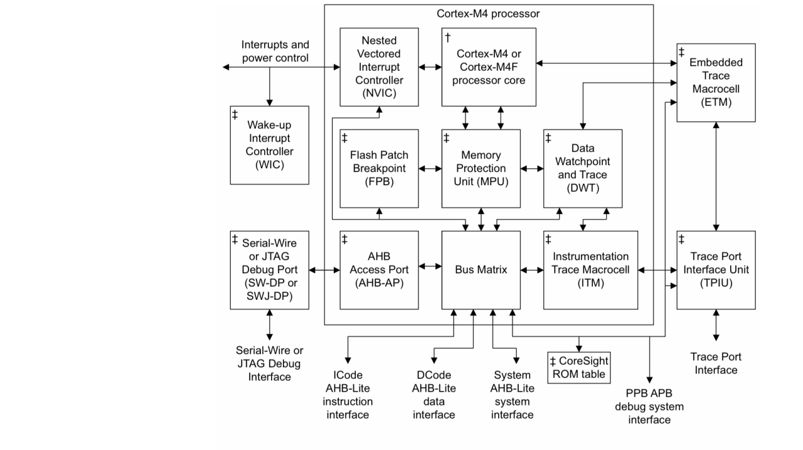
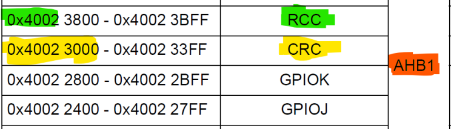
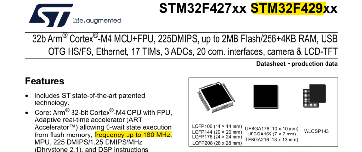
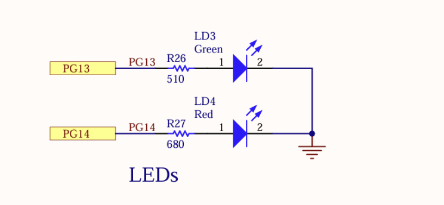

# Rust for Embedded Systems: A Hands-On Journey with the STM32F429I-DISC1

## Part 3: Timer Interrupts and Modular Bare-Metal Rust

> **Missed the previous parts?**  
> [Part 1: Prerequisites and Environment Setup](./part_01.md)  
> [Part 2: First Bare-Metal Project](./part_02.md)

---

### 3.1 Introduction

Welcome back to the third part of our series on embedded development with Rust!  
In [Part 1](./part_01.md), you set up your development environment and tools.  
In [Part 2](./part_02.md), you created your first bare-metal Rust project and flashed it to the STM32F429I-DISC1 board.

**In this part, we’ll take a significant step forward:**  
You’ll move from simply turning an LED on to toggling its state precisely using a timer interrupt. Our goal is to make an LED blink every second. We’ll also use an oscilloscope or logic analyzer to verify the timing and ensure our microcontroller’s clock is configured correctly.

---

### 3.2 Project Setup

You have two options to get started:
- **Option 1:** Continue with your existing `stm32f429_blinky` project from Part 2.
- **Option 2:** Use `stm32f429_blinky` as a template to generate a new project.

#### 3.2.1 Continue with the Previous Project

Simply keep working in your existing `stm32f429_blinky` directory.

#### 3.2.2 Create a New Project from the Old One

If you want to use the previous project as a template, you can either copy and paste the folder or use `cargo generate` (installed in Part 1 as an optional tool).

```bash
cargo generate <path>\stm32f429_blinky
```
When prompted, give the new project a name (e.g., `timer-int-led-toggle`).

```bash
cd .\timer-int-led-toggle\
vim Cargo.toml
```
Change the package name in `Cargo.toml` to match your new project.

---

### 3.3 Modularity and Project Structure

Before writing timer and LED logic, let’s organize the project for clarity and scalability.

We’ll create two main modules:
- **mcu:** Low-level code for initializing and configuring microcontroller peripherals (GPIO, clocks, timers).
- **app:** Higher-level application logic (LED and timer behavior).

Your folder structure will look like this:

```
timer-int-led-toggle/
├── .cargo/
│   └── config.toml
├── Cargo.toml
├── memory.x
├── src/
│   ├── main.rs
│   ├── app/
│   │   ├── mod.rs
│   │   ├── led.rs
│   │   └── set_timers.rs
│   └── mcu/
│       ├── mod.rs
│       ├── startup_stm32f429zi.rs
│       ├── registers.rs
│       ├── systemclock.rs
│       ├── gpio.rs
│       └── timer.rs
└── target/
    └── ... (build artifacts)
```

Create these files and directories inside `src/`:

```bash
mkdir app
mkdir mcu
touch app/mod.rs app/led.rs app/set_timers.rs
touch mcu/mod.rs mcu/gpio.rs mcu/systemclock.rs mcu/timer.rs
mv startup_stm32f429zi.rs mcu/startup_stm32f429zi.rs
```

---

### 3.4 MCU Setup: Direct Register Access

Now we begin configuring the MCU by writing directly to its registers. This gives us complete control and a deep understanding of the hardware. The most critical step is setting up the system clock, but before that, let’s define some register utilities and collect all register addresses in one file.

> **Note:** For the full content of the files mentioned in this tutorial, see the project’s GitHub repository.

#### 3.4.1 Register File (`src/mcu/registers.rs`)

Collect base addresses for all register files from the RM0090 Reference Manual’s Memory Map chapter and write them as constants. Note also the BUS on which the peripheral is available; we will need this for later when we enable the clock for that bus.



```rust
// AHB1 Bus
pub const RCC_BASE: u32 = 0x4002_3800;

// System Bus (ARM Cortex-M4 Core Peripherals)
pub const NVIC_BASE: u32 = 0xE000_E100;

#[inline(always)]
pub fn reg_write(reg: &mut u32, val: u32) {
    unsafe { core::ptr::write_volatile(reg, val) }
}
```

*See the GitHub repository for the full file.*

---

### 3.5 System Clock Configuration (`src/mcu/systemclock.rs`)

We will write a function that directly manipulates the registers of the RCC (Reset and Clock Control) and other peripherals to configure the system clock to 180 MHz. This involves enabling the oscillator, overdrive mode, configuring the PLL, setting flash latency, and switching the system clock source.

> **Why Overdrive?**  
> The STM32F429 can run up to 180 MHz, but needs "overdrive" mode for reliable operation at this speed.

Snippet from datasheet for clock speed:



---

### 3.6 LED and Timer Setup

<!-- TODO: Add detailed steps for configuring GPIO for LED, setting up the timer, and writing the interrupt handler. -->



---

### 3.7 Writing the Application Logic

<!-- TODO: Add code and explanation for toggling the LED in the timer interrupt, and how to verify timing with an oscilloscope or logic analyzer. -->

---

### 3.8 Building, Flashing, and Testing

<!-- TODO: Add instructions for building, flashing, and verifying the project, including troubleshooting tips. -->

---

### 3.9 Debugging and Verification

<!-- TODO: Add debugging steps, using GDB or probe-rs, and how to check the timer/LED signal. -->

---

### 3.10 Next Steps

<!-- TODO: Suggest further experiments, such as using multiple timers, PWM, or external interrupts. -->

---

**Congratulations!**  
You’ve now structured your project for modularity and are ready to implement timer-driven LED blinking with precise timing.

